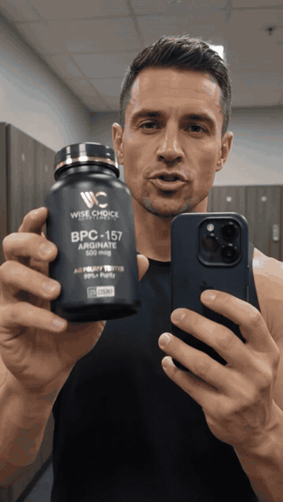

# LTX 2.3 — Multi-Shot Video Generation

A 60-second portrait-format generative-video case study with recurring subject and product imagery.

The complete main demo plays here automatically as a silent looping animation. No play button or dropdown is needed.

**[Open MP4 version](assets/demo.mp4)** · **[Technical approach](docs/architecture.md)** · **[Evaluation](results/metrics.md)** · **[Media notes](docs/media.md)**

Synthetic video output; the animation plays automatically. Model attribution follows the supplied project folder.

## Overview

A supplied generative-video output moves between gym, product, vehicle, and close-up scenes. The case study focuses on what can be inspected in the exported video: recurring visual identity, shot transitions, product visibility, and motion continuity.

**Stack:** LTX 2.3 / ComfyUI project context · portrait video · multi-shot presentation

## What it does

- Present a complete 60-second portrait-format output.
- Inspect recurring subject and product appearance across multiple scenes.
- Review both a lightweight automatic preview and a full audio/video export.

## Results and evidence

| Measured asset property | Value |
| :--- | ---: |
| Source duration | 60.00 s |
| Source resolution | 720 × 1280 |
| Source orientation | Portrait |

Measured from the supplied file with FFprobe. These are output properties, not model-quality scores or generation throughput.

## Engineering approach

A multi-shot video must preserve recognizable subject and product details across composition changes. Small text and hand/product interactions provide useful stress cases for visual review.

This repository is an output showcase, not a reconstructed ComfyUI workflow. No model version is claimed beyond the supplied folder label. The clip contains product imagery; it is presented as synthetic visual work, not as evidence for product efficacy or an endorsement.

## Limitations

The folder identifies LTX 2.3, but no workflow JSON, prompts, seed, generation logs, or settings were supplied. The export alone cannot establish the exact generation chain, compute cost, temporal consistency score, or which edits occurred after generation.

## Explore the project

Open the looping preview or [download the full video](assets/demo.mp4). Reproduction requires the original workflow, compatible models, input assets, and execution settings; those were not present in the provided project folder.

## Repository scope

This repository contains curated output media, technical context, and an evaluation plan. The supplied project folder contained no code or workflow graph to publish. Model weights, checkpoints, datasets, secrets, caches, and original Git history are excluded.

AI-generated/synthetic video showcase based on the supplied project context. Depicted products, people, brands, and claims are not independently verified or endorsed. No model weights or fabricated workflow files are distributed.

See [NOTICE](NOTICE) for publication and attribution notes.
