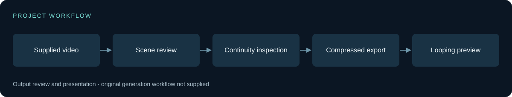

# Technical approach

[Back to the showcase](../README.md)

This repository is an output showcase, not a reconstructed ComfyUI workflow. No model version is claimed beyond the supplied folder label. The clip contains product imagery; it is presented as synthetic visual work, not as evidence for product efficacy or an endorsement.

## Main engineering issue

A multi-shot video must preserve recognizable subject and product details across composition changes. Small text and hand/product interactions provide useful stress cases for visual review.

## Boundaries

The folder identifies LTX 2.3, but no workflow JSON, prompts, seed, generation logs, or settings were supplied. The export alone cannot establish the exact generation chain, compute cost, temporal consistency score, or which edits occurred after generation.

The diagram shows the public review/presentation process. It is deliberately not an invented model-generation graph.

